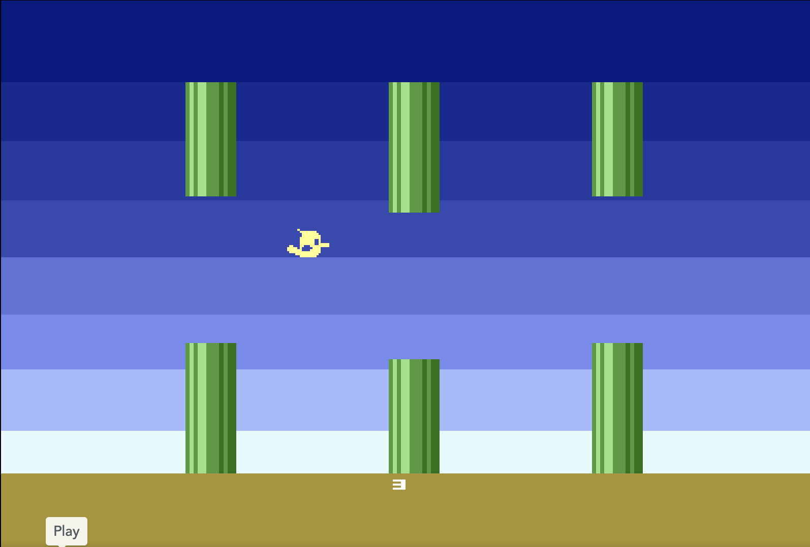

# C16 Flappy Bird



Flappy Bird for a stock 16 KiB PAL Commodore 16, written in ACME assembler.
Space flaps. Each pipe you clear scores one point. Release Space and press
it again to restart. The fixed bottom row shows HIGH with the session best on the left, TEDDY BIRD
in the center and SCORE with the current score on the right. Numbers use
leading zeros to fill four places (five above 9999). On game over, PRESS SPACE
blinks in the center and the bird turns TED color 2 at luminance 6. The best score survives round restarts.

Play it in the browser: https://phausser.github.io/c16-flappy-bird/

## Build

Requires [ACME](https://sourceforge.net/projects/acme-crossass/), Python 3 and
VICE (`xplus4`).

```sh
make           # build/flappy.prg
make run       # start it in VICE as a PAL C16
make lint      # build, then check style, names and zero-page addresses
```

The game fits in 16 KiB RAM and uses all six bird animation frames plus
pipe end caps from the supplied assets.

Edit letters, digits and pipe glyphs in [src/font.inc](src/font.inc).
Each glyph has eight binary bytes, one per pixel row (bit 7 on the left).

Scroll, collision, pipes, tests and the raster trace are in [TECH.md](TECH.md).
Implementation requirements are in [SPEC.md](SPEC.md), remaining work in
[TODO.md](TODO.md). CPU regression tests require `py65` in a Python virtual
environment; rebuilding the bird masks also requires Pillow.

```sh
python tests/score.py
python tests/obstacles.py
python tests/collision.py
python tests/gradient.py
```

## License

[MIT](LICENSE)
